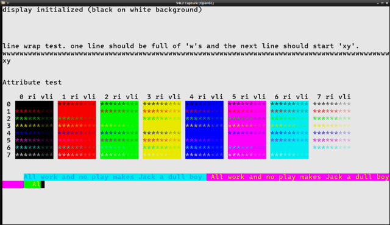
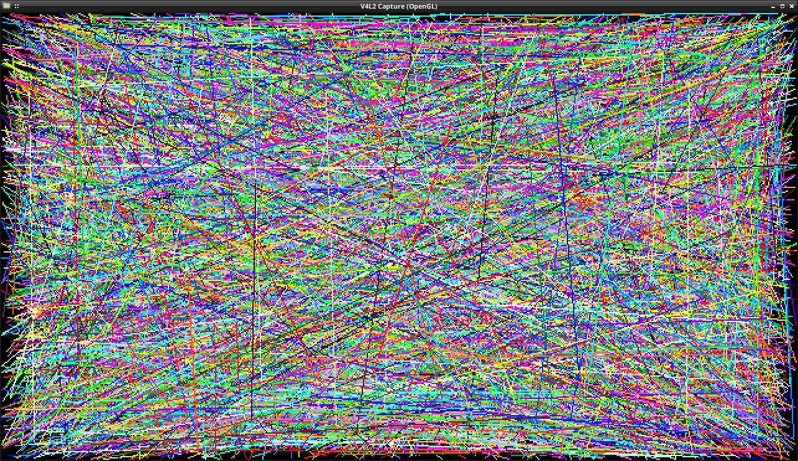

# DVI for HSTX (Adafruit Arduino library) <!-- omit in toc -->

This repository is home to the Adafruit GFX compatible DVI driver for RP2 chips with HSTX (e.g. Adafruit Metro RP2350, Adafruit Fruit Jam).

**Important note on overclocking:** This library overclocks your RP2 chip to 264MHz. Simply including the `<Adafruit_dvhstx.h>` header enables this overclocking, separate from the option in the Arduino Tools menu.
Just like PC overclocking, there’s some risk of reduced component lifespan, though the extent (if any) can’t be precisely quantified and could vary from one chip to another.
Proceed at your own discretion.

- [Introduction](#introduction)
- [Documentation](#documentation)

## Introduction

DV HSTX will enable you to create big, bold audio visual projects using Arduino and an HDMI display of your choice.

## Documentation

See the examples in the `examples` folder. These examples should all work without changes on the Adafruit Feather RP2350, Adafruit Metro RP2350, and Adafruit Fruit Jam, as well as any other boards that define the HSTX pinout with preprocessor macros `PIN_CKP`, PIN_D0P`, PIN_D1P`, and `PIN_D2P`. If these are defined, then you can simply use `DVHSTX_PINOUT_DEFAULT`. 

If your board does not define the HSTX pin mapping, it can be written as 4 numbers inside curly braces: `{ckp, d0p, d1p, d2p}` where e.g., `ckp` is the GPIO# of the positive pin in the clock pair, d0p is the positive pin in the D0 or red pin pair, and so on.
